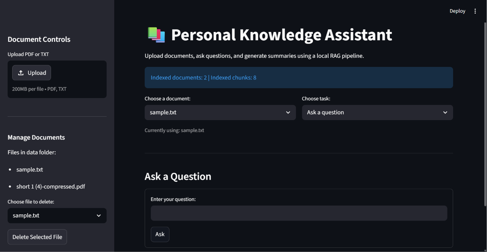
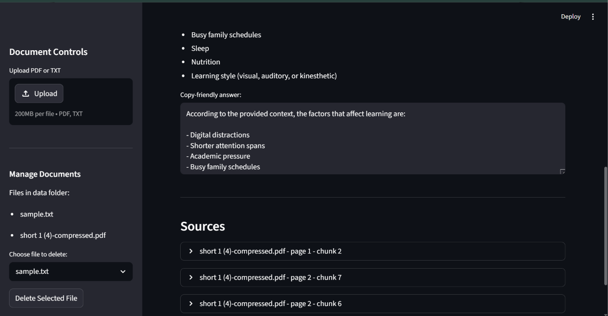
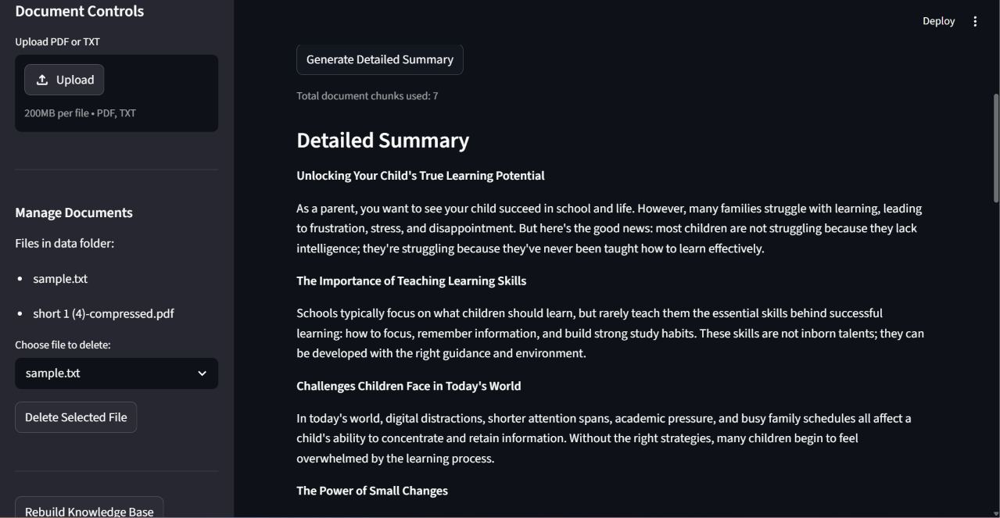

# Personal Knowledge Assistant

A local RAG-based knowledge assistant that lets users upload PDF and TXT files, ask questions from selected documents, and generate detailed summaries using a local AI model.

This project was built as part of my AI Generalist learning roadmap to understand how Retrieval-Augmented Generation works in practice.

---

## Features

- Upload PDF and TXT documents
- Manage uploaded documents from the app
- Delete selected documents
- Rebuild the local knowledge base from the browser
- Select a specific document before asking questions
- Ask questions from selected documents
- Generate detailed summaries
- View source chunks used for each answer
- See PDF page numbers in sources
- Copy answers from a copy-friendly text box
- Copy summaries from a copy-friendly text box
- Run locally without paid AI APIs

---

## Screenshots

### Main App



### Answer With Sources



### Detailed Summary Mode



---

## What This Project Does

Personal Knowledge Assistant allows users to upload their own documents and ask questions based on those documents.

Instead of relying only on the general knowledge of an AI model, the app retrieves relevant content from uploaded files and gives that content to a local LLM before generating an answer.

The app supports two main modes:

1. **Ask a Question**  
   Retrieves the most relevant document chunks and generates an answer based on them.

2. **Detailed Summary**  
   Uses the selected document's chunks to generate a detailed summary.

---

## Why This Project Matters

Normal AI models can hallucinate because they answer from general training data.

This project uses RAG, which means Retrieval-Augmented Generation.

In simple terms:

```text
User question
→ retrieve relevant document chunks
→ send chunks to local LLM
→ generate answer based on retrieved context
```

This makes answers more grounded because the model uses the user's documents as context.

---

## Tech Stack

- Python
- Streamlit
- Ollama
- llama3:8b
- ChromaDB
- PyMuPDF / fitz
- Requests
- Git and GitHub

---

## Key Concepts Learned

This project helped me understand:

- RAG
- Embeddings
- Chunking
- Vector search
- Metadata
- Source tracking
- PDF text extraction
- Local LLM usage
- Prompt pipelines
- Difference between Q&A retrieval and summary retrieval
- Difference between original files and indexed vector data

---

## Project Structure

```text
personal-knowledge-assistant/
│
├── app.py
├── ingest.py
├── ask.py
├── search.py
├── test_ollama.py
├── requirements.txt
├── README.md
├── .gitignore
│
├── screenshots/
│   ├── main-app.png
│   ├── answer-with-sources.png
│   └── summary-mode.png
│
├── data/
│   └── uploaded documents
│
└── chroma_db/
    └── local ChromaDB vector database
```

---

## How RAG Works in This Project

The app follows this pipeline:

```text
PDF/TXT documents
→ text extraction
→ chunking
→ embeddings
→ ChromaDB vector storage
→ semantic retrieval
→ local LLM answer generation
→ answer with sources
```

### 1. Upload Documents

Users upload PDF or TXT files from the Streamlit sidebar.

Uploaded files are saved locally inside the `data/` folder.

### 2. Rebuild Knowledge Base

When the knowledge base is rebuilt, the app:

```text
reads documents
→ extracts text
→ splits text into chunks
→ creates embeddings
→ stores chunks in ChromaDB
```

### 3. Ask Questions

When a user asks a question, the app retrieves the most relevant chunks from the selected document.

Those chunks are sent to the local LLM as context.

### 4. Generate Answers

The local LLM generates an answer using the retrieved document chunks.

The app also shows source previews and PDF page numbers where available.

---

## Important Files

### `app.py`

Main Streamlit browser app.

It handles:

- File upload
- Sidebar layout
- Document selection
- Document deletion
- Knowledge base rebuild
- Question answering
- Detailed summary mode
- Source previews

### `ingest.py`

Handles document processing.

It:

- Reads uploaded files
- Extracts text from PDF and TXT files
- Splits text into chunks
- Adds metadata like filename and page number
- Stores chunks in ChromaDB

### `ask.py`

Terminal-based RAG question-answering script.

Useful for testing the RAG pipeline outside the browser app.

### `search.py`

Retrieval-only test script.

Useful for checking whether ChromaDB is returning relevant chunks.

### `test_ollama.py`

Tests whether Ollama is running and reachable from Python.

---

## How to Run Locally

### 1. Clone the Repository

```bash
git clone https://github.com/hamzaaamir981-droid/personal-knowledge-assistant.git
```

### 2. Go Into the Project Folder

```bash
cd personal-knowledge-assistant
```

### 3. Create a Virtual Environment

```bash
python -m venv .venv
```

### 4. Activate the Virtual Environment

For Windows PowerShell:

```bash
.\.venv\Scripts\activate
```

### 5. Install Dependencies

```bash
pip install -r requirements.txt
```

### 6. Install Ollama Models

```bash
ollama pull llama3:8b
ollama pull nomic-embed-text
```

### 7. Start the App

```bash
streamlit run app.py
```

---

## Usage Flow

```text
Upload PDF/TXT document
→ Rebuild Knowledge Base
→ Select document
→ Choose task
→ Ask question or generate summary
→ Review answer and sources
```

---

## Local Data Notes

The app stores uploaded documents and vector database files locally.

These folders are ignored by Git:

```text
data/
chroma_db/
```

This keeps private documents and generated vector database files out of GitHub.

---

## Current Limitations

- Large PDFs may take time to process
- Only one selected document is searched at a time
- No chat history yet
- No export option yet
- No DOCX support yet
- No web article ingestion yet
- Ollama must be running locally for answers to work

---

## Future Improvements

Planned improvements:

- Export summaries to `.txt`
- Multi-document question answering
- Chat history
- Better chunking for large PDFs
- Model selector
- Error handling when Ollama is not running
- DOCX file support
- Web article support
- Cleaner UI polish
- Demo video for portfolio

---

## What I Learned

This project helped me understand how a real RAG system works beyond theory.

The most important learning was that a RAG app has two separate parts:

```text
Original files
→ stored in data/

Searchable knowledge base
→ stored in ChromaDB
```

If files are uploaded or deleted, the knowledge base must be rebuilt so the searchable index stays updated.

I also learned that Q&A mode and summary mode need different retrieval strategies:

- Q&A mode should retrieve only the most relevant chunks.
- Summary mode should use more chunks from the selected document.

---

## Status

The MVP is complete and working locally.

The project can upload documents, index them, answer questions, generate summaries, and show sources with page numbers.
